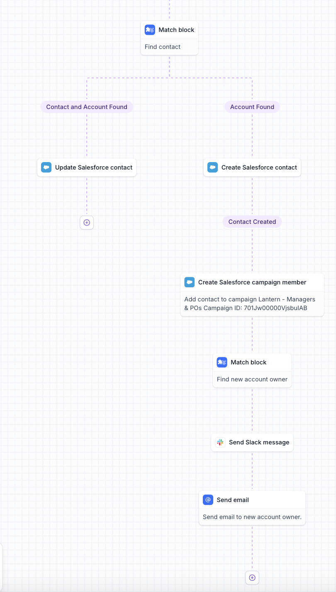

# Workflow Transformation Challenge

Context:
You're joining a team building a next-generation workflow builder. Our product allows users to define complex sequences of actions and conditions, connecting them into graph-like structures that represent their workflows. We'd like to see how you approach modeling, transforming, and scaling data that represents these workflows.

Overview of the Task:
We will start with a simple data transformation exercise and then progressively increase the complexity. By the end, you should have a structured, graph-like representation of workflows that could be easily visualized or manipulated in a frontend application, while also being able to be compiled into runnable code on the backend.

## Step 1:
Take a look at `actions.json` or `actions.csv`. Ignore the `evaulated_keys` field for now.

Transform this into a node/edge representation suitable for a workflow visualization.

Take a peek at https://reactflow.dev/examples to get an idea of how the front end might render a workflow.

Here are screenshots of the workflow that the actions.json should create:

## Step 2:
Write a workflow deserializer that turns a flow representation from step 1 and creates an executable file. Each node can be a function that just prints some info about it.

Let's run it and see if it prints in the correct order.

## Step 3:
Let's design a database schema that will manage:
1. Workflow definitions and versions
2. Action definitions and versions
3. Workflow run metadata (such as evaluated keys (or a better way to keep track of which records have been processed before)) and
4. Record traces for each action execution per record for observability and debugging (a relational database might not be the tool for this one)

We should keep action version history so workflows don't break when actions get updated, and workflow version history to keep track of revisions over time.

## Step 4:
Write a function that traverses the graph and verifies each node's parameter types and input/output types.

What We're Looking For:

Code Quality: Clear, maintainable, and well-structured code.
Scalability: The solution should handle increasing complexity gracefully. Adding a new level of complexity shouldn't require a complete rewrite.
Flexibility: Ability to incorporate new metadata, node/edge types, or conditions without breaking the existing transformations.
Testing & Validation: Show how you'd test transformations at each level to ensure correctness.
