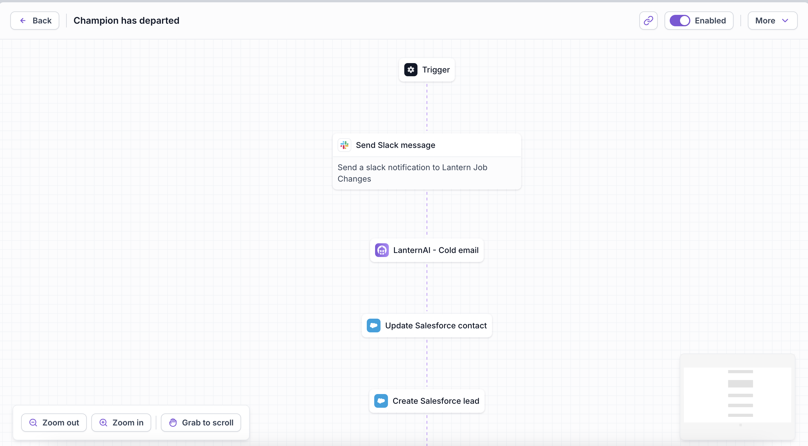
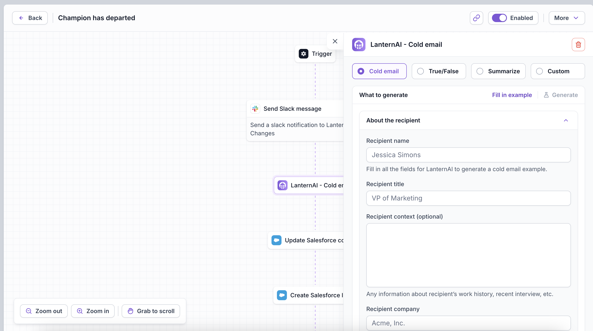
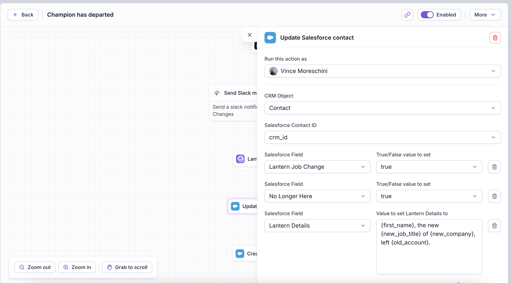

### Introduction to the Technical Interview

Welcome to your technical interview! Today, we'll be focusing on a practical assessment that mirrors real-world software development practices. Our goal is to evaluate your ability to build functional software in a collaborative environment. Here's how we'll proceed:

#### 1. **Project Scope**
We'll work together on a small project designed to fit within our interview timeframe. The project will be sufficiently complex to test your coding skills and system design abilities but scoped to be achievable.

#### 2. **Collaborative Environment**
This will be a collaborative effort. You will pair with one of our engineers who will act both as a teammate and an evaluator. You’re encouraged to discuss your strategies, ask questions, and leverage your collaborator's experience.

#### 3. **Resources**
Feel free to use any online resources you need, including Google and ChatGPT. These tools are part of the modern developer's toolkit, and knowing how to use them effectively is crucial.

#### 4. **Understanding and Implementation**
It’s essential that you understand any code you choose to use—whether it’s written from scratch, borrowed from a stack overflow page, or suggested by ChatGPT. You will need to explain your implementation choices, including how and why your solution works.

#### 5. **Functional Outcome**
Our aim is to have a working prototype by the end of this session. This approach mimics the "shipping" culture of our agile development environment, where we value working software as the primary measure of progress.

#### 6. **Contingency Planning**
Should we run out of time before achieving a fully functional product, don’t worry. You’ll be asked to outline how you would complete the project, including the steps, technologies involved, and any additional features or fixes you would prioritize.

This interview is designed to be an engaging way for you to demonstrate your practical coding skills, problem-solving abilities, and teamwork mindset. Let’s build something great together!

### Project Description: Frontend for Workflow Automation System

#### Objective:
Develop the frontend for a workflow automation system that allows users to visually manage automation workflows, specifically focusing on tasks related to sales lead management.

#### Screenshots

#### System Requirements:

**1. Frontend Functionality:**
   - **Node Management**:
     - **Adding New Nodes**: Implement a UI component that allows users to select and add different types of nodes (e.g., data fetch, data process, API call) from a predefined list.
     - **Rendering Nodes**: Each type of node should be rendered differently based on its functionality (e.g., different icons, colors, shapes) to easily distinguish between them.
     - **Modifying Nodes**: Clicking on a node should open a node-specific panel where users can modify properties of the node such as API endpoints, parameters, etc.

   - **Workflow Visualization**:
     - **Branching Nodes**: Implement a way to visually represent branching logic in the workflow where a node can lead to multiple paths based on certain conditions.
     - **Interactive Canvas**: Use a draggable canvas area where nodes can be moved around and arranged to form a logical flow.

#### Development Steps:
1. **Setup Project**:
   - Initialize a new React project using Create React App.

2. **Node List Implementation**:
   - Create a component to list available node types.
   - Implement the functionality to drag nodes from this list into the workflow canvas.

3. **Workflow Canvas Setup**:
   - Integrate `react-flow` to set up a canvas where nodes can be placed and interconnected.
   - Customize node appearance based on their type using custom node renderers.

4. **Node Modification Panel**:
   - Develop a panel that opens when a node is clicked.
   - Allow users to modify node properties with form inputs that are specific to the type of the node.

5. **Branching Logic Visualization**:
   - Design a method to visually display conditional branches from nodes.
   - Allow users to add condition paths and link them to different node types.

6. **Testing and Debugging**:
   - Test the application for usability and functionality.
   - Ensure that the application is responsive and nodes are rendered appropriately on all devices.

7. **Documentation**:
   - Write comprehensive documentation on how to use the frontend, including how to add, configure, and connect nodes.

This frontend setup will empower users to create and manage complex workflows visually and interactively, enhancing the user experience and providing powerful tools for workflow automation.
